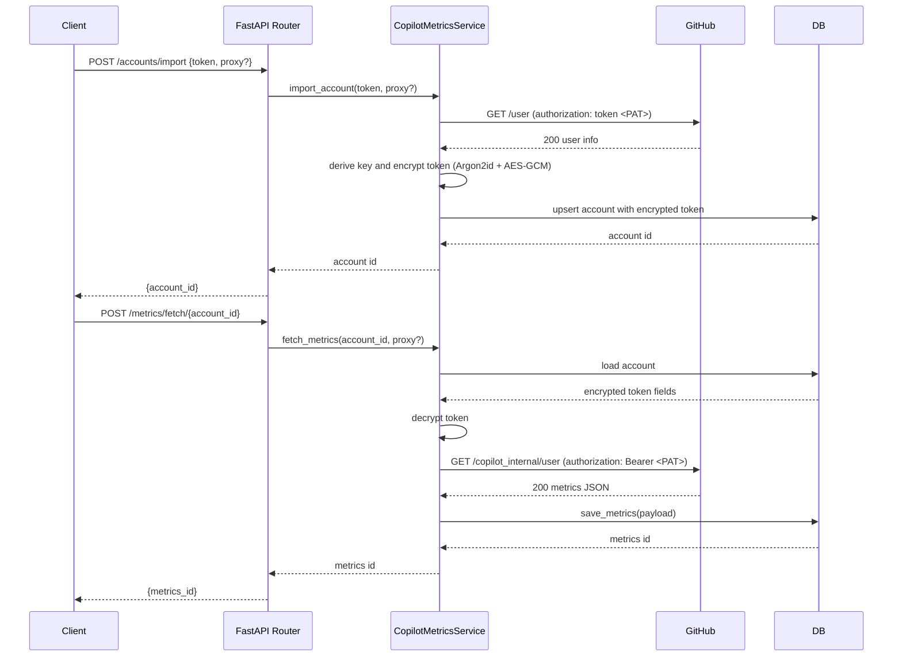

Copilot Metrics Plugin

Overview
- Provides endpoints to import GitHub accounts by access token and fetch GitHub Copilot usage metrics.
- Stores encrypted access tokens and raw metrics payloads in the database for safe retrieval.

Key Features
- Import GitHub account using a Personal Access Token (PAT).
- Encrypt tokens with Argon2id-derived AES‑GCM; only decrypt when calling APIs.
- Fetch Copilot metrics and store the latest payload per account.
- List accounts and retrieve latest metrics per account or for all accounts.

Environment
- `PLUGINS_ENABLED` must include `copilot_metrics`.
- `COPILOT_METRICS__TOKEN_SECRET` must be set to a hex string from `openssl rand -hex 32`.
- No global proxy is used. An optional per-request `proxy` field is supported when importing accounts.

Database Models
- `copilot_github_accounts`
  - `login`, `github_user_id`, `node_id`, `avatar_url`
  - `token_ciphertext`, `token_nonce`, `token_salt` (base64 strings)
  - `created_at`, `updated_at`
- `copilot_metrics`
  - `account_id` (FK → `copilot_github_accounts`)
  - `fetched_at`
  - `payload` (JSON string)

Dependencies
- `argon2-cffi` and `cryptography` are required for token encryption.
- Installed via the project `requirements.txt`.

Enable and Run
- Ensure `.env` contains:
  - `PLUGINS_ENABLED=hello,analytics,items,copilot_metrics`
  - `COPILOT_METRICS__TOKEN_SECRET=<hex-64>`
- Run with Docker:
  - `docker compose up --build`
  - FastAPI will be available at `http://localhost:8000/`.

API Endpoints (prefix: `/plugins/copilot_metrics`)
- Import account
  - `POST /accounts/import`
  - Body: `{ "token": "gho_...", "proxy": "http://localhost:9090" }` (proxy optional)
  - Response: `{ "account_id": 1 }`
- List accounts
  - `GET /accounts`
  - Response: `[{ id, login, github_user_id, node_id, avatar_url, created_at, updated_at }]`
- Get one account
  - `GET /accounts/{account_id}`
  - Response: `{ id, login, github_user_id, node_id, avatar_url, created_at, updated_at }`
- Fetch metrics for an account
  - `POST /metrics/fetch/{account_id}`
  - Response: `{ "metrics_id": 42 }`
- Get latest metrics for an account
  - `GET /metrics/{account_id}`
  - Response: `{ id, account_id, fetched_at, payload }`, where `payload` is a JSON object from Copilot API
- Get latest metrics for all accounts
  - `GET /metrics`
  - Response: `[{ id, account_id, fetched_at, payload }, ...]`

Curl Examples
- Import account:
  - `curl -X POST 'http://localhost:8000/plugins/copilot_metrics/accounts/import' -H 'accept: application/json' -H 'Content-Type: application/json' -d '{"token":"gho_xxx"}'`
- Fetch metrics:
  - `curl -X POST 'http://localhost:8000/plugins/copilot_metrics/metrics/fetch/1'`
- Get metrics for account:
  - `curl 'http://localhost:8000/plugins/copilot_metrics/metrics/1'`
- List accounts:
  - `curl 'http://localhost:8000/plugins/copilot_metrics/accounts'`

Security Notes
- Tokens are never stored in plaintext; they are encrypted with a key derived from `COPILOT_METRICS__TOKEN_SECRET` using Argon2id.
- AES‑GCM with per-record nonce and salt is used; do not rotate `COPILOT_METRICS__TOKEN_SECRET` without a migration strategy.

Implementation Details
- Encryption: Argon2id (`argon2.low_level.hash_secret_raw`) to derive a 32‑byte key from `COPILOT_METRICS__TOKEN_SECRET` + random salt; AES‑GCM for encryption/decryption.
- HTTP client: `httpx.Client` with reasonable timeout; per-request `proxy` is supported only on account import.
- External APIs:
  - GitHub User: `GET https://api.github.com/user` with header `authorization: token <PAT>`.
  - Copilot Metrics: `GET https://api.github.com/copilot_internal/user` with header `authorization: Bearer <PAT>`.

Architecture

```mermaid
flowchart TD
    A[Client] -->|POST /accounts/import| B[FastAPI Router]
    B --> C[CopilotMetricsService]
    C --> D[httpx to GitHub /user]
    C --> E["Encrypt token (Argon2id + AES-GCM)"]
    E --> F[(DB: copilot_github_accounts)]

    B -->|POST /metrics/fetch/&#123;account_id&#125;| C
    C --> G[Decrypt token]
    G --> H[httpx to Copilot API]
    H --> I[save_metrics]
    I --> J[(DB: copilot_metrics)]

    B -->|GET /metrics/&#123;account_id&#125;| K[latest_metrics_for_account]
    K --> J
    B -->|GET /metrics| L[latest_metrics_all]
    L --> J
```

Flow

Common Errors
- `401 Unauthorized`: invalid or expired token; ensure the PAT is valid.
- `COPILOT_METRICS__TOKEN_SECRET not configured`: set the secret in `.env`.
- Database connectivity: check `DATABASE_URL` and service availability.

Testing Tips
- Use mock responses for `httpx.Client` to test import and metrics fetch flows without hitting GitHub.
- Verify that `payload` is stored as JSON string and returned as a decoded object by the API.